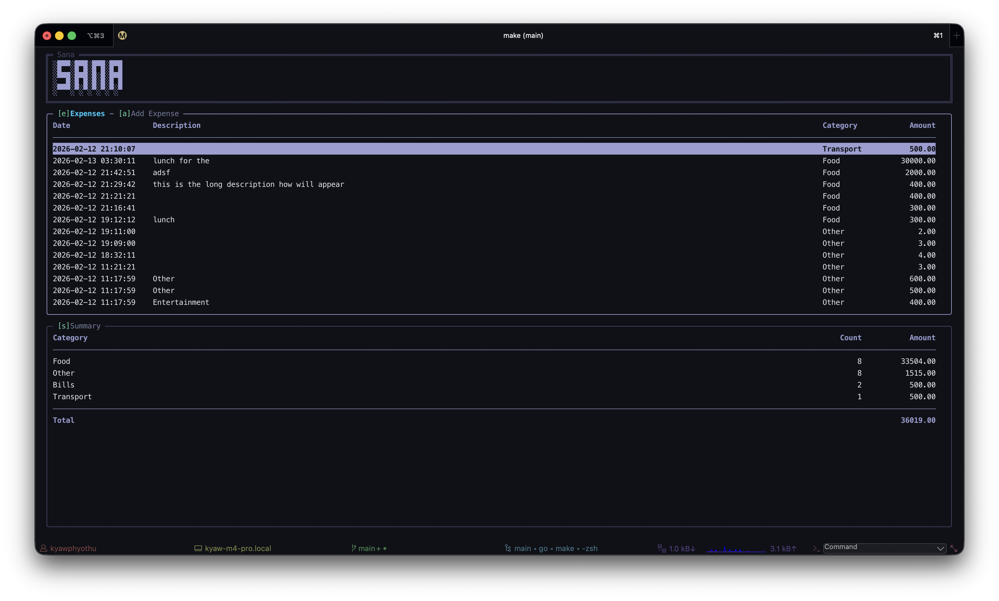

# Sana

A simple terminal-based expense tracker built with Go.



## Features

- Track expenses with date, description, category, and amount
- View expense summary by category
- Terminal user interface (TUI)

## Usage

### Run the development application

```bash
make run
```

### Run the production application

```bash
make run-prod
```

or

```bash
make install
sana
```

## Keybindings

### Expenses box

- `d` - Delete expense

### Add box

- `tab` - Autocomplete suggestion or move to next field
- `shift+tab` - Move to previous field
- `down` - Move to next field
- `up` - Move to previous field
- `enter` - Submit form
- `esc` - Cancel form

### Summary box

- `space` - Toggle overlay
- `esc` - Close overlay

### Global keybindings

- `a` - Select Add box
- `s` - Select Summary box
- `e` - Select Expenses box
- `m` - Select Monthly Report box
- `j` / `down` - Move selection down
- `k` / `up` - Move selection up
- `g`/ `home` - Move selection to top
- `G`/ `end` - Move selection to bottom
- `r` - Refresh data
- `q` / `ctrl+c` - Quit
