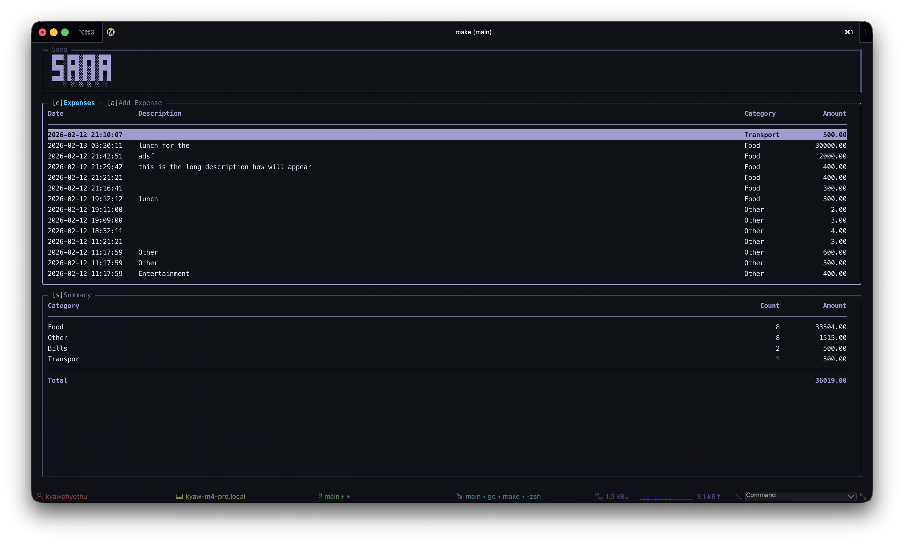

# Sana

A simple terminal-based expense tracker built with Go.



## Features

- Track expenses with date, description, category, and amount
- View expense summary by category
- View monthly report of expenses
- **CLI** – add, delete, and list expenses from the command line (no TUI)

## Installation

##### Linux:

Ubuntu/Debian:

```bash
curl -LO https://github.com/kyawphyothu/sana/releases/latest/download/sana_0.1.4_linux_amd64.deb
sudo dpkg -i sana_0.1.4_linux_amd64.deb
sudo apt -f install -y
```

Fedora/RHEL:

```bash
curl -LO https://github.com/kyawphyothu/sana/releases/latest/download/sana_0.1.4_linux_amd64.rpm
sudo dnf install -y ./sana_0.1.4_linux_amd64.rpm
```

Any Linux distribution:

```bash
curl -LO https://github.com/kyawphyothu/sana/releases/latest/download/sana_Linux_x86_64.tar.gz
tar -xzf sana_Linux_x86_64.tar.gz
cd sana
sudo mv sana /usr/local/bin/
```

##### macOS:

```bash
brew tap kyawphyothu/tap
brew install --cask sana
```

## Usage

Sana can be used in two ways: **TUI** (interactive) or **CLI** (subcommands and flags).

### TUI (interactive)

Run with no arguments to start the terminal UI:

```bash
make run          # development (data in ./data)
make run-prod     # or: sana (uses config dir)
```

Or after installing: `sana` (no args).

### CLI (command line)

Use subcommands to add, delete, or list expenses without the TUI. Handy for scripts or quick one-liners.

**List** expenses for a month (default: current month):

```bash
sana list                    # current month
sana list -month 2025-03     # specific month (YYYY-MM)
```

**Add** an expense:

```bash
sana add -amount 25.50 -description "Coffee"
sana add -amount 100 -description "Rent" -type bills -date 2025-03-01
```

| Flag | Required | Description |
|------|----------|-------------|
| `-amount` | yes | Expense amount (positive number) |
| `-description` | yes | Short description |
| `-type` | no | Category: `food`, `transport`, `bills`, `shopping`, `health`, `other` (default: other) |
| `-date` | no | Date as `YYYY-MM-DD` or `today` (default: today) |

**Delete** an expense by ID:

```bash
sana delete -id 42
```

Get help for a subcommand:

```bash
sana add -h
sana list -h
sana delete -h
```

## Keybindings

### Expenses box

- `d` - Delete expense

### Add box

- `tab` - Autocomplete suggestion or move to next field
- `shift+tab` - Move to previous field
- `down` - Move to next field
- `up` - Move to previous field
- `enter` - Submit form
- `esc` - Cancel form

### Summary box

- `space` - Toggle overlay
- `esc` - Close overlay

### Monthly Report box

- `enter` - Select month

### Global keybindings

- `a` - Select Add box
- `s` - Select Summary box
- `e` - Select Expenses box
- `m` - Select Monthly Report box
- `j` / `down` - Move selection down
- `k` / `up` - Move selection up
- `g`/ `home` - Move selection to top
- `G`/ `end` - Move selection to bottom
- `r` - Refresh data
- `q` / `ctrl+c` - Quit
- `?` - Show help menu
